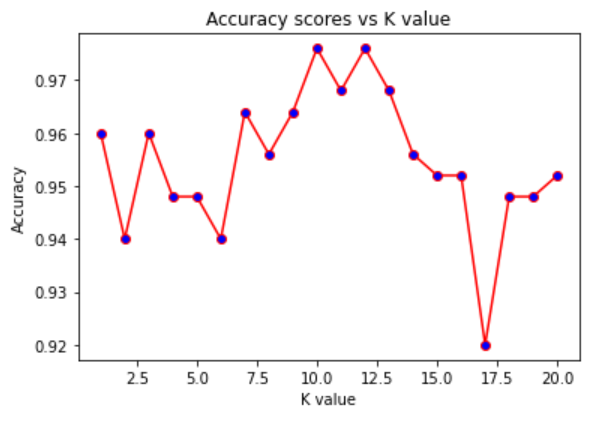

# 6020_Machine-Learning Homework 1
## Group Members:
- Arup Ghosh: ghosha20@students.ecu.edu
- Ping Wang: wangp19@students.ecu.edu
## Quick Start
- Clone the repository
- Open " hw1-KNN.ipynb" file in Jupyter Notebook and run the code
- **Note:** Code for installing libraries is included in hw1-KNN.ipynb file, no need to install through requirements.txt file but still we listed the required libraries in this requirements.txt file.
   
## Discussion about "K"
- **The relationship between"K" and the model accuracy:**

 

- **Best K?**
- As in the above line chart, accuracy score are similar as k falls in (1,20). We calculated the accuracy scores 5 times for each k and it gave similar accuracy score for each k. Then we run KNN 10 times for each k and got the same result----accuracy score is not affected a lot by value of k. The reason is that the samples of this dataset are almost perfectly seperated into 3 clusters depending on their types, so the accuracy scores are within(0.92,0.98) which is high, no matter how many neighbors we choose. In this case, we will assign n^(1/2), which is around 12, to be the value of k.
