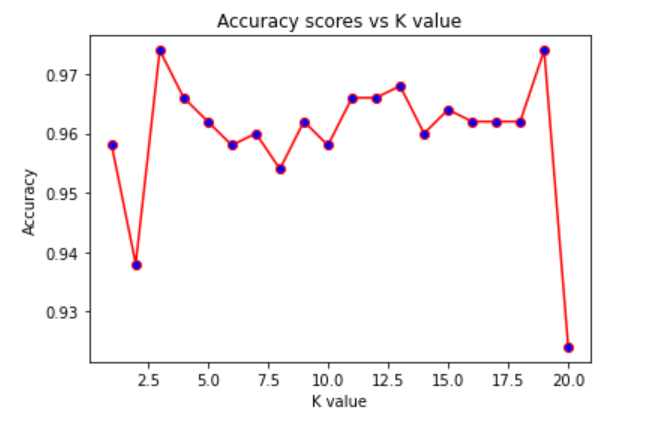

# 6020_Machine-Learning Homework 1
## Group Members:
- Arup Ghosh: ghosha20@students.ecu.edu
- Ping Wang: wangp19@students.ecu.edu
## Quick Start
- Clone the repository
- Open " hw1-KNN.ipynb" file in Jupyter Notebook and run the code
- **Note:** Code for installing libraries is included in hw1-KNN.ipynb file, no need to install through requirements.txt file but still we listed the required libraries in this requirements.txt file.
   
## Discussion about "K"
- **The relationship between"K" and the model accuracy:**

 

- **Best K?**
- As in the above line chart, accuracy score increases from (0.9,0.97) to 1 as K reaches 6. The reason is that the more neighbors(>=6 in this case) a sample has, the more possible that higher number of "good neighbors"(belong to the same class as the sample does) than that of "bad neighbors" will be included and voting, such that there will be higher chance that the sample is clssified to the true class.
