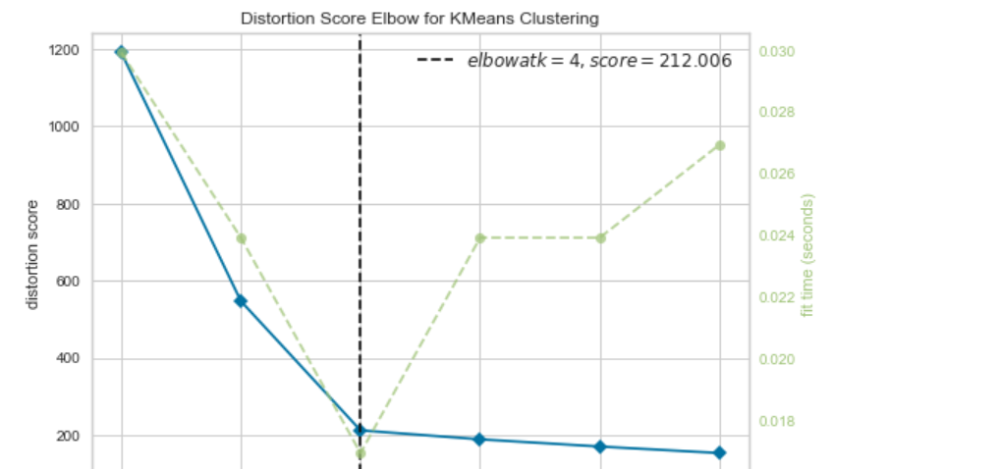

# 6020_Machine-Learning Homework 1
## Group Members:
- Arup Ghosh: ghosha20@students.ecu.edu
- Ping Wang: wangp19@students.ecu.edu
## Quick Start
- Clone the repository
- Open " hw1-KNN.ipynb" file in Jupyter Notebook and run the code
## Discussion about "K"
- **Choose best k using elbow method:**

 

- **Best K?**
As in the above line chart, K=3 works the best.
- **Accuracy score for k=3**
Accuracy score=

- **Confusion matrix for k=3**
