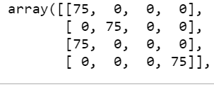

# 6020_Machine-Learning Homework 2
## Group Members:
- Arup Ghosh: ghosha20@students.ecu.edu
- Ping Wang: wangp19@students.ecu.edu
## Quick Start
- Clone the repository
- Open " hw2-kmeans.ipynb" file (under "HW2" folder) in Jupyter Notebook and run the code
## Discussion about "K"
- **Choose best k using elbow method:**

 

- **Best K?**
  
  As in the above line chart, K=4 works the best.
- **Accuracy score for k=4**
   
   Accuracy score=0.75

- **Confusion matrix for k=4**

  
