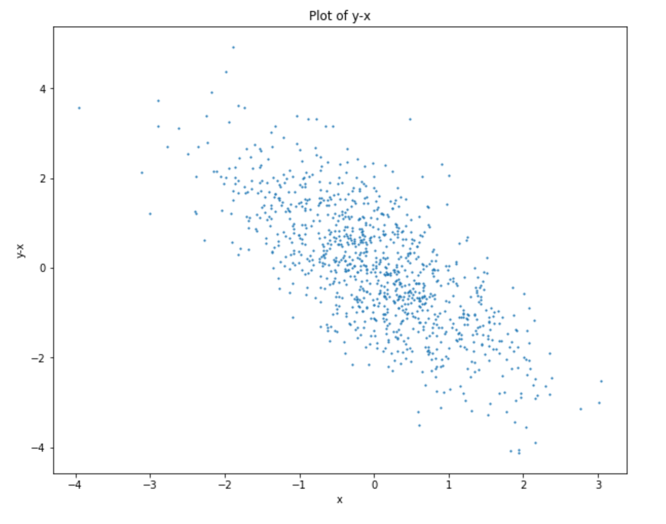
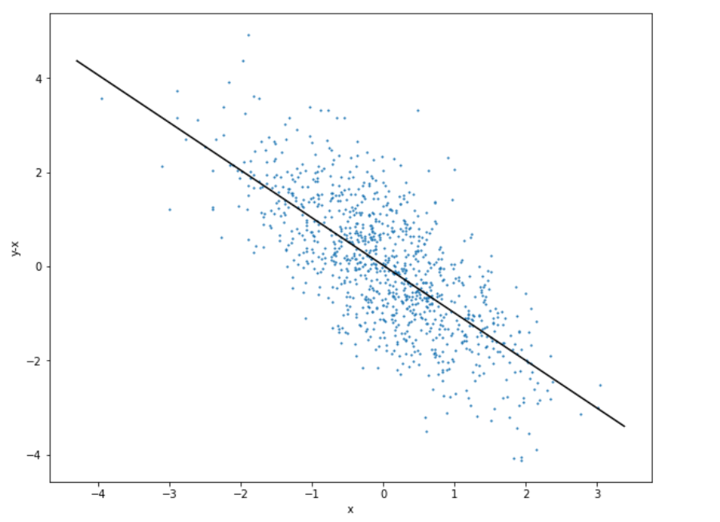

# 6020_Machine-Learning Homework 3
## Group Members:
- Arup Ghosh: ghosha20@students.ecu.edu
- Ping Wang: wangp19@students.ecu.edu
## Results
- **Plot 1**
- (y-x)--x plot
 
- **Plot 2**
- Regression line
 
